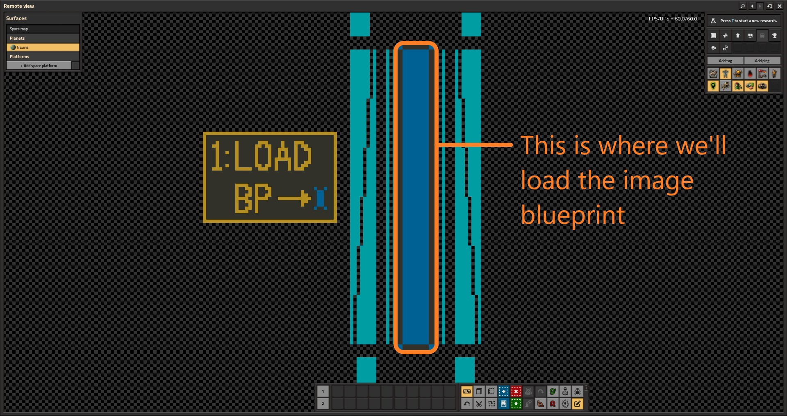
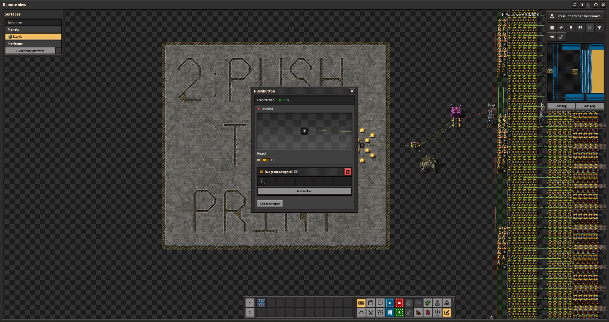

# Quickstart Guide

Here's what you need to get the printer working ASAP:

## Steps

1. Make sure you satisfy the [Software Requirements](#software-requirements).
2. Clone the repository to a local directory on your machine.
3. Put your desired image to print into `image/Run/` and make sure no other images are present.
4. Use Python to run the script called `create_blueprint_from_image.py`
5. Add the Factorio_Printer_v3.0 save file to your local saves, and open it in Factorio. [See Here](#adding-the-factorio-printer-to-your-saves) for more info.
6. Follow the [In-Game](#in-game) steps.

## Software Requirements

* python 3.12
* python libraries:
  * os, base64, json, zlib (included with python)
  * numpy
  * pandas
  * luadata
  * pillow (PIL fork)
* Factorio 2.0
* Factorio Space Age DLC (requires all three SA mods)
* Factorio Mods:
  * Editor Extensions [LINK](https://mods.factorio.com/mod/EditorExtensions)
  * Color Coding [LINK](https://mods.factorio.com/mod/color-coding)
  * Pushbutton [LINK](https://mods.factorio.com/mod/pushbutton)
  * Whats a Spoilage [LINK](https://mods.factorio.com/mod/whats_a_spoilage)
* the Factorio_Printer_v3.0 save file added to your local save directory. 

## Adding the Factorio Printer to your saves

In windows, your Factorio save files can be found by:
1. Opening windows explorer, clicking the path bar, and typing `%appdata%` and hitting enter.
2. Opening the `Factorio/` folder. Inside this folder is a folder called `saves/`
3. Copy `FACTORIO_PRINTER_V3.0.zip` into this save folder. You should now be able to open it in the game.

In Linux, your Factorio save files can be found by:
1. Opening file explorer, click the path bar, and typing `~/.factorio/` and hitting enter.
2. You should be in the Factorio folder, and there should be a folder called `saves/`.
3. Copy `FACTORIO_PRINTER_V3.0.zip` into this save folder. You should now be able to open it in the game.

## In-Game

1. Open the Factorio_Printer_3.0 save in Factorio, with the required mods. Your default save location in windows can be found by navigating to `%appdata%` and from there opening `./Factorio/saves/` folder. On Linux, `~/.factorio/saves/`

2. Open your map (default `m`) and zoom out until you can see the entire structure of the printer. You should see a box on the center left with "1: LOAD BP" written. Zoom in on the box and bank of combinators, but not so far that you leave map view.

3. Alt+tab to `Blueprint Out/`, and drag the `.txt` file directly into the map. It may take a few seconds, but then the game should say 'Blueprint imported successfully' and you will be holding the blueprint. Click a spot in your quickbar to save the blueprint there and make Factorio the active screen. Note: you may need to place the game in windowed mode to do this, especially on a single screen.

4. Align the blueprint with the block and click to place. **DO NOT FORCE BUILD**. There are four combinators on the interior corners that are rotated a different direction, and you can easily see if the blueprint is not aligned:

5. Move to the right until you see the outlined box that says '2: PUSH TO PRINT', and zoom in so that you can see the entities. Click the combinator, and click `On`. This is a pushbutton combinator, so it will immediately switch back off.

6. Exit the GUI for the combinator, and move to the right. The printer is now printing. If you leave map view, the in-person view is centered over a target shaped tag that corresponds to the approximate center of the image. You can see more of the image from in-person view, however the more of the print you are watching, the slower it will go. Each inserter is responsible for 600 pixels, and they move every 10 ticks, so this works out to 600 * (10 / 60) = 100 seconds of activity per inserter. Overall, a print should take ~120 seconds to finish, provided the game can run at 60 UPS.

7. Making sure the in-person view is centered on the target, open the console with `~`, and run `/screenshot 6050 2925 0.25`. This will create a JPG screenshot of the image, which will get put into `script-output/` inside your Factorio folder.
