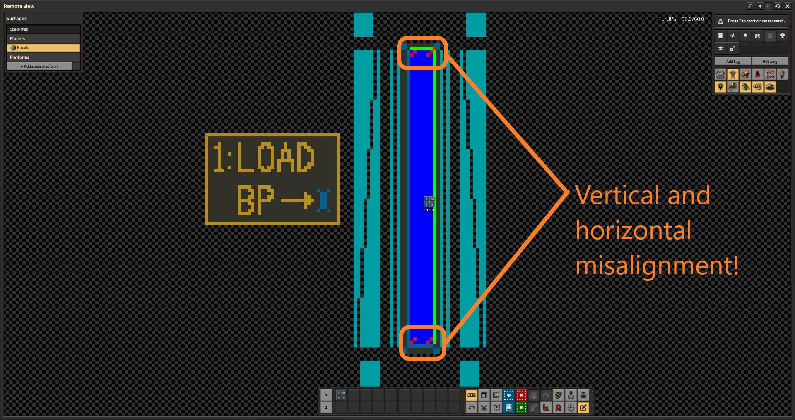
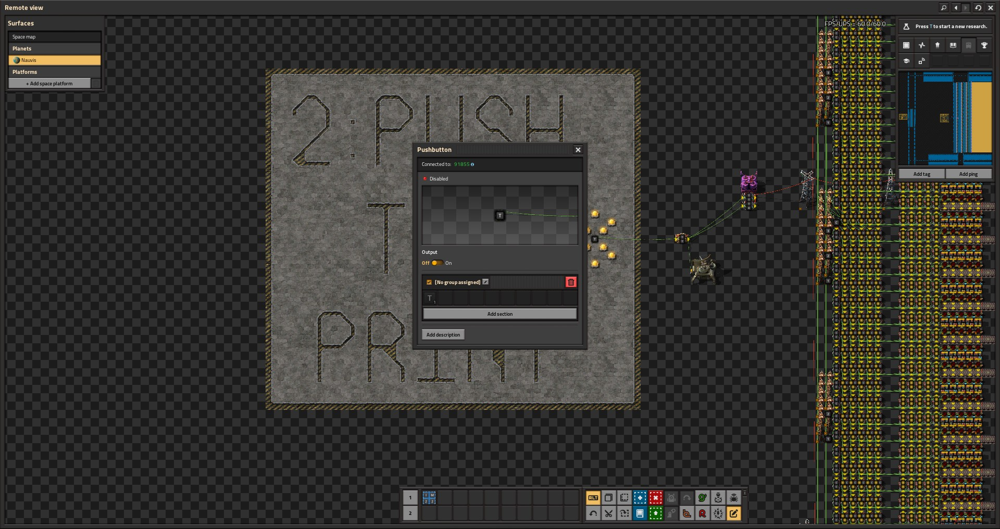

# Factorio Printer v3.0
The purpose of this project is to take an input image and recreate it within the game Factorio, displayed as items arranged on belts to form the pixels. This is accomplished with python scripts which process the image and export a .txt file with the blueprint string, ready to be dragged and dropped into the Factorio game window. This is a sequel to [Color Image Printer, 480 x 180 pixels](https://www.reddit.com/r/factorio/comments/r0itzg/color_image_printer_480_x_180_pixels/).

This printer can create images of up to 3000 x 720 = 2.16 million pixels, with each pixel a stack of four items, totalling 8.64 million items.

## Minimum Working Example

See the [Quickstart Guide](QUICKSTART.md)

## Requirements

* python 3.12
* python libraries:
  * os, base64, json, zlib (included with python)
  * numpy
  * pandas
  * luadata
  * pillow (PIL fork)
* Factorio 2.0
* Factorio Space Age DLC (requires all three SA mods)
* Factorio Mods:
  * Editor Extensions [LINK](https://mods.factorio.com/mod/EditorExtensions)
  * Color Coding [LINK](https://mods.factorio.com/mod/color-coding)
  * Pushbutton [LINK](https://mods.factorio.com/mod/pushbutton)
  * Whats a Spoilage [LINK](https://mods.factorio.com/mod/whats_a_spoilage)
* the Factorio_Printer_v3.0 save file added to your local save directory. 


## Usage

There are three main user scripts contained:

* `create_sample_images.py`:

   This script reads the image located in `/image/Run`, applies image crop and size edits, and creates and outputs a set of JPGs of approximations of the original image, with a number of dithering methods used to apply palette colors to pixels. The outputs are put into `/image/Output`.

   The script will first output an adjusted original image which shows the original image with vertical pixels halved, and image cropping editing applied but no color changes. Then, it will output one image for each combination of `dither_method` and `closeness_metric` called.

   Arguments:
   * `dither_method = ['Blue Noise', 'Error Diffusion', 'Tetrahedral', 'Cubic', 'Octahedral', 'Dodecahedral', 'Nearest Color']`
      
      Supply one or a list of dither methods. Nearest Color applies nearest palette color without pre-dithering the pixels. Error Diffusion uses a 16-step periodic error diffusion algorithm to match colors. The rest use various methods of pre-shifting the colors at each point before matching nearest palette color.

    * `closeness_metric = ['Euclidean', 'Non-Euclidean']`  
       
       Color proximity of palette colors to individual pixels is calculated using one of two metrics, applied on the RGB color space. Select one or the list to see variations of all images using both algorithms.
       
       Euclidean algorithm is the standard one: 
       
       `d_color = sqrt((r1 - r2)^2 + (g1 - g2)^2 + (b1 - b2)^2)`
       
       while the Non-Euclidean one is a very slight variation on one taken from https://www.compuphase.com/cmetric.htm: 
       
       `d_color = sqrt((2 + r_bar/256) * (r1 - r2)^2 + 4 *(g1 - g2)^2 + (2 + (256 - r_bar)/256) * (b1 - b2)^2)`

       where

       `r_bar = (r1 + r2) / 2`

       **NOTE I have not confirmed that this metric  satisfies the triangle inequality.**

    * `quality_icon = ['legendary', 'epic', 'rare', 'uncommon', 'normal', 'all']`

       Adds a small quality icon to the image before processing. If a list is supplied, only the first will be used. `'normal'` will result in no icon added.

    * `image_crop = 'None'`
       
       Can pass a tuple to crop the original image before any other processing. Tuple is `(left, upper, right, lower)` values, starting from `(0, 0)` as upper left-most pixel.

    * `image_scale = ['fit', 'center', 'x2 center']`

      * `'fit'` scales the image to largest size to fit within `(3000, 1440)`    
      * `'center'` keeps original scale and crops if necessary to fit within `(3000, 1440)`
      * `'x2 center'` doubles original scale and crops if necessary to fit within `(3000, 1440)`

      image cropping happens before the editing. If a list is passed, only the first option is used in output images.

    * `image_color = 1.0` 
      
      Passthrough of PIL.ImageEnhance.Color + .enhance(). `0.0` is convert to grayscale, `1.0` is normal color, greater than 1 increases saturation. Because the palette is duller than stored values, image_color > 1 recommended for unedited photos and screenshots of in-game factories. Not recommended images with high saturation.

    * `image_contrast = 1.0`
      
      Passthrough of PIL.ImageEnhance.Contrast + .enhance(). `1.0` is unedited

    * `image_brightness = 1.0`

      Passthrough of PIL.ImageEnhance.Brightness + .enhance(). `0.0` is black, `1.0` is unedited, greater than 1 is brighter.
   
    * `image_sharpness = 1.0`

      Passthrough of PIL.ImageEnhance.Sharpness + .enhance(). `1.0` is unedited

     


* `create_blueprint_from_image.py`:
   
   This script takes the same arguments as `create_sample_images.py`, but will only produce one export. Uses the first items in any lists passed. Creates a blueprint string for the corresponding image, which is exported into `Blueprint Out/`. The file will have naming convention `BP_<index>_<original image name>.txt`, where index is 1 + the largest index in files already in `Blueprint Out/`. This same index is used in the icons for the blueprint in game. For example, if the largest index in the folder is 20, and `create_blueprint_from_image.py` is called on an image called `orchid.jpg`, the output will be called `BP_21_orchid.txt`, and the blueprint will have icons 'I', 'M', '2', '1' when loaded in-game.

   **In Game:**

   1. Open the Factorio_Printer_3.0 save in Factorio, with the required mods. Your default save location in windows can be found by navigating to `%appdata%` and from there opening `./Factorio/saves/` folder. On Linux, `~/.factorio/saves/`

   2. Open your map (default `m`) and zoom out until you can see the entire structure of the printer. You should see a box on the center left with "1: LOAD BP" written. Zoom in on the box and bank of combinators, but not so far that you leave map view.

   

   3. Alt+tab to `Blueprint Out/`, and drag the `.txt` file directly into the map. It may take a few seconds, but then the game should say 'Blueprint imported successfully' and you will be holding the blueprint. Click a spot in your quickbar to save the blueprint there and make Factorio the active screen. Note: you may need to place the game in windowed mode to do this, especially on a single screen.

   4. Align the blueprint with the block and click to place. **DO NOT FORCE BUILD**. There are four combinators on the interior corners that are rotated a different direction, and you can easily see if the blueprint is not aligned:

   

   5. Move to the right until you see the outlined box that says '2: PUSH TO PRINT', and zoom in so that you can see the entities. Click the combinator, and click `On`. This is a pushbutton combinator, so it will immediately switch back off.

   

   6. Exit the GUI for the combinator, and move to the right. The printer is now printing. If you leave map view, the in-person view is centered over a target shaped tag that corresponds to the approximate center of the image. You can see more of the image from in-person view, however the more of the print you are watching, the slower it will go. Each inserter is responsible for 600 pixels, and they move every 10 ticks, so this works out to 600 * (10 / 60) = 100 seconds of activity per inserter. Overall, a print should take ~120 seconds to finish, provided the game can run at 60 UPS.

   7. Making sure the in-person view is centered on the target, open the console with `~`, and run `/screenshot 6050 2925 0.25`. This will create a JPG screenshot of the image, which will get put into `script-output/` inside your Factorio folder.

* `image_crusher.py`

   The screenshots taken by Factorio end up being quite large, often ~40 mb or more. The image_crusher script is a quick utility script that loops through all images in `image/Crusher/`, opens and resaves them with the same name + `_cr.jpg`, and deletes the old images. This is very fast for Factorio screenshots, and reduces the file sizes by ~90%.

## More Information

### Palette

Palette colors were assigned by running full belts of items, taking a screenshot, and doing image analysis in R. The item sprites in game aren't very saturated, and liberal use is made of items within the Color Coding mod and Editor Extension mod to get more saturated colors, as well as using the Whats a Spoilage mod to turn off spoilage for some of the Gleba items.

The resulting set of colors was better, but still not amazing. For example, the closest to white was around (215, 215, 215). I took the set of palette colors and adjusted them - brightening and saturating them, to give better color coverage. The downside to this is that printed images look very washed out compared to the original.

From here, I chose a black (black refined concrete) and white (space science pack), then from there iteratively found the palette color furthest from the existing set, and added it. (Distance with Euclidean metric). This was done 123 times, to get a palette of 125 items.

The palette items and the adjusted color values I use for them are viewable in `dat/Final_Palette.csv`.

Here is the sample image included in the git repository:


This image was run with `create_factorio_blueprint_from_image(dither_method = 'Blue Noise')` :


Noticeably washed out. Here's the same image, run with `create_factorio_blueprint_from_image(dither_method = 'Blue Noise', image_color = 1.3, image_contrast = 1.5)`:


### Non-square pixels

Belts in Factorio carry items on two sides, and the smallest singular unit of belt, which takes up one in-game 'tile', holds 4 spots of items on each side of the belt. That means that for a belt facing left-to-right, the belt is four items wide but only two tall, resulting in expressible pixels which are twice the height that they are wide:

```  
  +----+
  |ABCD|
  |ABCD|
  |EFGH|
  |EFGH|
  +----+
```

As a result, the image processing by necessity 'squashes' vertical pixels, combining adjacent pixels, before doing any dithering and color matching. The internal function `export_im_df` takes this into account, automatically doubling the height of the image before exporting. Note that the dimensions printed in the console and the description of the blueprint double the actual y pixels. Thus, the maximum print is 3000 x 720 = 2.16 megapixels, but this will show in the console and description as (3000, 1440). 


### Dithering


The printer itself has a palette of only 125 unique items, so extensive use of different dithering methods is used to approximate images with the limited palette. 

#### Blue Noise Dithering

Blue noise is noise that is distributed in a very uniform way. It's also periodic - a blue noise image can be tiled, and still preserve this uniformity. A seed blue noise image is loaded, and pixels in the image are shifted by a small amount relating to the colors in the blue noise image. The resulting image has approximately the same overall colors, but now setting each pixel to its closest palette color results in better gradients and color depth.

Blue noise image taken from [Free blue noise textures](https://momentsingraphics.de/BlueNoise.html), which also has very good explanations and examples.

#### Polygonal Dithering

Similar to blue noise dithering, pixels at each point are shifted by a predetermied amount. A regular platonic solid is centered about the origin, and each face represents a color shift, + the origin (representing no color change). Thus 'octahedral' dithering involves the 8 faces of the octahedron + the origin to make 9 potential color shifts each pixel might undergo. These are applied in order to all pixels, giving polygonal dithered images a very distinct patterned look, which may be aesthetically desireable, especially for representing cell-shaded or artificial images. `['Tetrahedral', 'Cubic', 'Octahedral', 'Dodecahedral']` are the available polygonal dithers.

#### Error Diffusion

Error diffusion is an iterative process: a pixel or pixels are chosen, and their nearest palette colors are found. Then, a comparison is done between the desired pixel color and the palette color, and this is saved as the error. The error is then distributed to neighboring pixels, so that their pixel color is adjusted by some amount of that error. When those pixels are later matched to colors, they are more likely to be assigned palette colors which combine with the previous colors to make the desired color. 

As a simple example: suppose I wanted to make a group of pixels yellow, but I only had red and green. I pick the first pixel, and say that red is the closest color. Since I really wanted yellow, and I got red, my error was (-red, +green). I add some amount of that error to the neighboring pixels, and this makes them slightly more green and less red. When I go to pick the color of one of those pixels, I'll be more likely to pick the green palette color. Groups of pixels will 'average out' to correct intermediate colors, _provided that you have good color coverage from your palette_. Unfortunately the colors available in the current version of the printer are not very saturated (even though I heavily tweak the RGB values to treat them as if they do), so error diffusion will often show obvious 'dead areas' in colors that are more saturated than available in the palette.

Since error diffusion is an iterative process, it is more computationally intensive than the other dithering methods. I created a custom periodic algorithm which maps 1/16th of the pixels in each step, and transfers error according to the following matrix, where [P] is the original pixel:
```
[    0     0  1/18     0     0 ]
[    0  1/12   1/6  1/12     0 ]
[ 1/18   1/6   [P]   1/6  1/18 ]
[    0  1/12   1/6  1/12     0 ]  
[    0     0  1/18     0     0 ]
```

Occasionally this can produce some cool results, but takes a long time to run. One particular benefit of using error diffusion is that black (0,0,0) always ends up as black-refined-concrete. Other methods will have brown-refined-concrete interspersed. For more info on error diffusion, I recommend https://en.wikipedia.org/wiki/Error_diffusion.

### Construction

In Factorio 2.0, constant combinators can export hundreds or even thousands of distinct signals, a massive improvement over the strict 20 of 1.0. There are 146 'virtual' signals and 4 levels of biter signals used in the image storage. Each signal cat itself be a quality level of normal, uncommon, rare, epic, and legendary. Parallel signals at different qualities correspond to parallel inserters filling the same lane of belts. A singal signal stores four pixels; at 125 palette colors the signal is `n = p1 + 125 * p2 + 125^2 * p3 + 125^3 * p4`.

Thus the `0-normal`, `0-uncommon`, `0-rare`, `0-epic`, `0-legendary` signals within one combinator store the first twenty pixels printed onto the belt for that combinator, i.e. the right-most 20 pixels. Each combinator holds 750 signals = 3000 pixels, exactly the number on one side of a belt. Thus each combinator neatly stores the pixels for exactly one row, 720 combinators total. They are ordered right-to-left and top-to-bottom, so the upper right-most combinator in the array stores the upper half of the top lane of belt, the top row of combinators stores the top 4 lanes of belts, and so on.

Within Factorio: every inserter operates on the same tick, no exceptions, every ten ticks (unless outside of the picture). A timer counts from 1 to 7000 at the click of the pushbutton, and this is // 10 to produce k, the pixel index. Since inserters operate at the same time, adjusting the pixels based on location of inserter only requires offsetting k by a constant at each column.

Signals are passed through five selector combinators to split into each quality. Then, a selector combinator loops through the set of possible signals using `k // 4`, to pick which signal the given column should be expressing at that time. The result has the correct palette index read with appropriate amount of `// 125` and `% 125`, which is then aggregated * different powers of 2 and sent to the print block proper.

Black (black refined concrete) is the color 0, as this allows black margins to be 'empty' combinators, saving on space. Similarly, if the set of four pixels for a signal are all blank, this item is filtered out of the signal list, so it won't take up space in the blueprint. Thus, small images run using `'fit'` settings will still print with 2.16 million pixels, but the size of the blueprint will be much smaller.

### Future Plans

I've had my fill of trying to make a weird or very gray palette work for the printer. My next step will be to start modding, to create a set of mod items with good, saturated colors.

Additional immediate goals with this project:

* Optional arguments to change dithering amount
* Create a working website that will create the blueprint .txt and preview images
* Custom Factorio modding

## Contribution

This is my first public project and I'm still getting my bearings. I would prefer not to have outside contribution at this time. Please contact me if you feel strongly about this.
